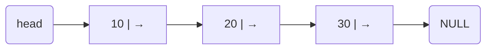
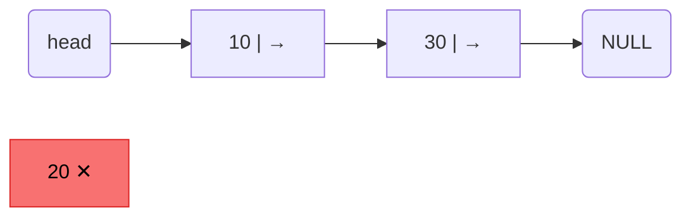

# Linked Lists

> This is a reusable template. Replace placeholders with your own notes, examples, and code.

## 1. Definition

- A linked list is:
- How it differs from an array:
- When to use it:

## 2. Core Concepts

### 2.1 Node Structure

```text
[ data | next ]
```

- `data`:
- `next`:

### 2.2 Types of Linked Lists

- Singly Linked List:
- Doubly Linked List:
- Circular Linked List:
- Circular Doubly Linked List:

## 3. Time Complexity (Quick Table)

| Operation | Singly | Doubly | Notes |
|---|---|---|---|
| Access by index | O(n) | O(n) | No random access |
| Insert at head | O(1) | O(1) | |
| Insert at tail | O(n) / O(1)\* | O(n) / O(1)\* | \*If tail pointer is maintained |
| Delete at head | O(1) | O(1) | |
| Delete by value | O(n) | O(n) | Search first |
| Search | O(n) | O(n) | |

## 4. Basic Operations

### 4.1 Insert at Head

1. 
2. 
3. 

### 4.2 Insert at Tail

1. 
2. 
3. 

### 4.3 Delete Node

1. 
2. 
3. 

### 4.4 Search

1. 
2. 
3. 

## 5. Implementation Templates

### 5.1 C (Singly Linked List)

```c
typedef struct Node {
    int data;
    struct Node *next;
} Node;
```

```c
Node *create_node(int data);
void push_front(Node **head, int data);
void push_back(Node **head, int data);
void delete_value(Node **head, int data);
Node *find(Node *head, int data);
void free_list(Node **head);
```

### 5.2 Python (Singly Linked List)

```python
class Node:
    def __init__(self, data):
        self.data = data
        self.next = None

class LinkedList:
    def __init__(self):
        self.head = None
```

### 5.3 Java (Optional)

```java
class Node {
    int data;
    Node next;

    Node(int data) {
        this.data = data;
        this.next = null;
    }
}
```

## 6. Diagram

### Singly Linked List



### Insert at Head (new value: 5)

Create new node → set new node's next to old head → update head to new node


### Insert at Tail (new value: 40)

Traverse to end → set last node's next to new node


### Delete a Node (delete 20)

Find the node before target → update its next to skip the target → free the deleted node



## 7. Edge Cases and Pitfalls

- Empty list handling:
- Single-node list:
- Deleting head node:
- Losing pointers during insertion/deletion:
- Memory leaks (C/C++):

## 8. Common Interview Problems

- Reverse a linked list
- Detect cycle (Floyd's tortoise and hare)
- Find middle node
- Merge two sorted linked lists
- Remove N-th node from end
- Check palindrome linked list

## 9. Real-World Use Cases

- 
- 
- 

## 10. Summary

- Key takeaways:
- Trade-offs vs arrays:
- What to practice next:

## 11. References

- Book/article:
- Official docs:
- Practice links:

