# 연결 리스트

> 재사용 가능한 템플릿입니다. 아래 항목을 본인 설명, 예시, 코드로 채워 사용하세요.

## 1. 정의

노드를 이용하는 리스트를 연결하는 자료 구조임.

### 배열과의 차이점:
배열: 같은 차원의 메모리공간을 여러개 이어서 만드는것. 링크드리스트는 이와 다르게 쭉 연결되있찌 않고 흩어져있는걸 연결함.

연결할때 기본단위를 노드라고 함. 배열에서는 중요하지 않지만 링크드리스트에서는 중요함. 노드 기반 자료구조


## 2. 싱글 링크드 리스트

### 노드

 - 노드: 데이터를 저장하는 기본 단위임
 - 구조체를 사용하여 구현

 예)
```c
struct node {
    int data; # 실제 데이터
    struct node* next; # 다음 노드의 주소를 저장하는 포인터
}
```

구조체는 struct를 이용해 사용하며 구조체 변수를 사용할떄도 struct을 이용해 선언함

```c
struct node n1; # 구조체 변수 선언
```

typedef을 사용하면 struct라는 키워드를 매번 사용하지 않고 선언간으

```c
typedef struct node {
    int data;
    struct node* next;
} Node;

# typedef을 사용하면 struct 키워드 없이도 선언 가능
Node n1; # 구조체 변수 선언
```

### 연결
 - 링크드 리스트는 노드를 연결할 리스트
 - 노드를 연결하는 방법은 다음 노드의 주솟값을 포인터 변수에 대입

```c
struct node {
    int data;
    struct node* next; # 다음 노드의 주소를 저장하는 포인터
}
```

### 노드 생성
 - 노드를 생성하는 방법은 구조체를 이용해 생성하며 정적 할당과 동적 할당이 있음

```c
typedef struct node {
    int data;
    struct node* next;
} Node;

node a[10]; # 정적 할당
Node* p = (Node*)malloc(sizeof(Node)); # 동적 할당
```

동적 할당:
 - malloc 함수를 이용해 메모리를 할당
 - 할당된 메모리는 포인터 변수에 저장

정적 할당:
 - 배열을 이용해 노드를 생성
 - 배열의 크기는 컴파일 타임에 결정

정적 할당 같은 경우에는 컴파일 타임에 결정남. 동적 할당은 런타임에 결정나기에 더 유연하게 사용할 수 있음. 동적 할당은 메모리를 효율적으로 사용할 수 있지만, 메모리 누수와 같은 문제를 일으킬 수 있음. 따라서 동적 할당을 사용할 때는 반드시 free 함수를 이용해 할당된 메모리를 해제해야 함.

### 노드 삽입

 - 노드를 삽입하는 방법은 리스트의 맨 앞, 맨 끝, 중간에 삽입이 있음

#### 기본 구조

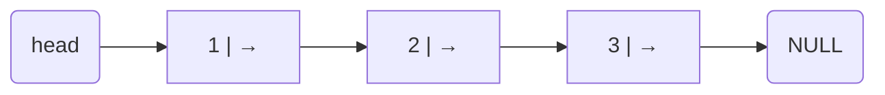

이런 식으로 노드가 연결되어 있는게 링크드 리스트임

#### 맨 앞에 삽입 (새 값: 0)

새 노드를 만들고 → 새 노드의 next를 기존 head로 설정 → head를 새 노드로 갱신

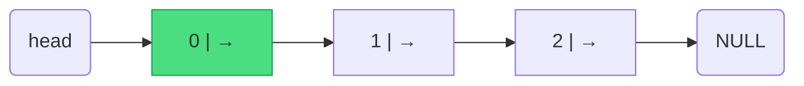

#### 맨 끝에 삽입 (새 값: 4)

리스트를 끝까지 순회 → 마지막 노드의 next를 새 노드로 연결

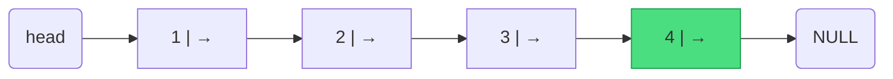

#### 중간에 삽입 (1과 2 사이에 값 5 삽입)

삽입 위치 이전 노드 탐색 → 새 노드의 next를 다음 노드로 설정 → 이전 노드의 next를 새 노드로 연결

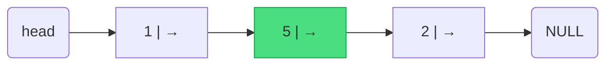

#### 노드 삭제 (값이 3인 노드 삭제)

```c
Node* prev = NULL;
Node* p = head;
while (p != NULL && p->data != 3) {
    prev = p;
    p = p->next;
}
if (p != NULL) {
    if (prev == NULL) head = p->next; // head 삭제
    else prev->next = p->next;        // 중간/끝 노드 삭제
    free(p);
}
```

**탐색 중** — prev는 이전 노드, p는 현재 노드를 가리키며 이동

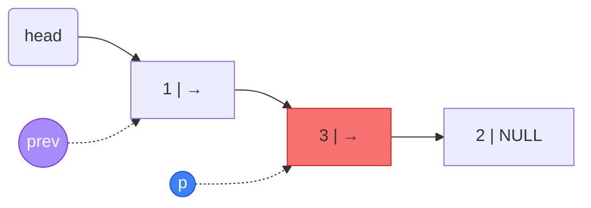

**삭제 후** — prev→next를 p→next로 연결하고 p(값 3) 해제

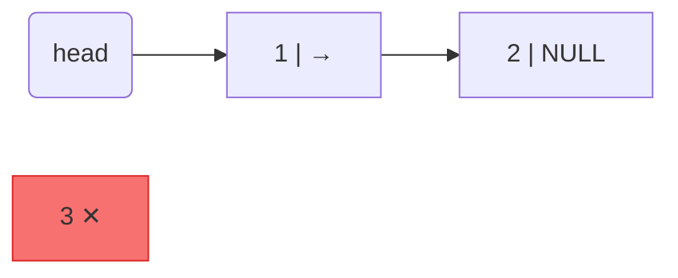

### 노드 갱신

 - 노드에 저장된 값 data를 갱신하기 위해서는 노드를 처음부터 마지막까지 순차적으로 비교하고 갱신함

```c
Node* p = head;
while (p->data != 2) {
    p = p->next;
}
p->data = 4;
```

**탐색 중** — p가 head부터 시작해 data가 일치하는 노드를 찾을 때까지 이동

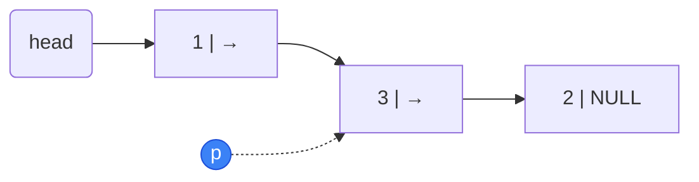

**갱신 후** — p→data == 2 발견, 값을 4로 갱신

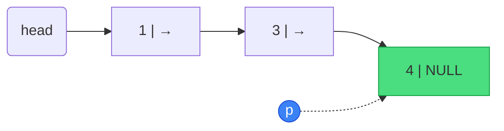

### C 언어 링크드 리스트

```c
#include <stdio.h>
struct node {
    int data;
    struct node* next;
};

int main() {
    struct node *head = NULL; # 리스트의 시작을 나타내는 포인터
    struct node a = {10, 0}; # 노드 a 생성
    struct node b = {20, 0}; # 노드 b 생성
    struct node c = {30, 0}; # 노드 c 생성
    head = &a; # head가 a를 가리키도록 설정
    a.next = &b; # a의 next가 b를 가리키도록 설정
    b.next = &c; # b의 next가 c를 가리키도록 설정
    c.next = NULL; # c의 next는 NULL로 설정 (리스트의 끝)
    
    printf("%d", head->next->data); # head의 다음 노드인 b의 data 출력 (20)
    
    return 0;
}
```

메모리 상 구조 — 각 노드가 어떻게 연결되는지

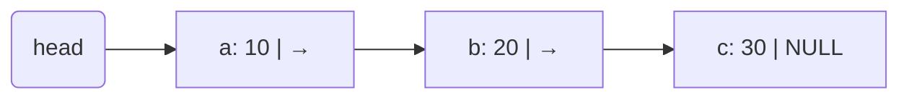

`head->next->data` 접근 경로

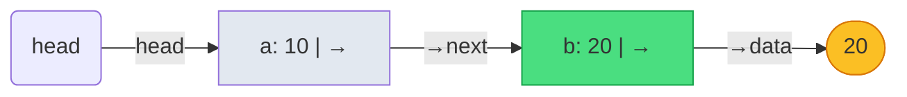

Output:
```
20
```

### 예제 2 — 인접 노드 값 교환 (func)

```c
#include <stdio.h>

struct Node {
    int v;
    struct Node *next;
};

// 인접한 두 노드의 값을 쌍으로 교환
void func(struct Node *n) {
    int t;
    while (n != NULL && n->next != NULL) {
        t = n->v;
        n->v = n->next->v;
        n->next->v = t;
        n = n->next->next;
    }
}

int main() {
    struct Node n1 = {1, NULL};
    struct Node n2 = {2, NULL};
    struct Node n3 = {3, NULL};
    struct Node *c = &n1;

    n1.next = &n3;
    n3.next = &n2;  // 리스트 순서: n1 → n3 → n2

    func(&n1);

    while (c != NULL) {
        printf("%d", c->v);
        c = c->next;
    }
    return 0;
}
```

**func 호출 전** — `c = &n1`, 리스트는 n1→n3→n2 순서로 연결됨

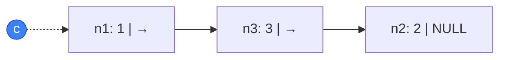

**func 실행** — `while` 루프가 인접 쌍(n1↔n3)의 값을 교환

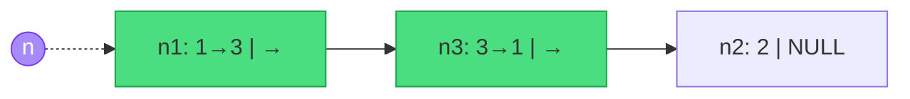

`n = n->next->next` 으로 이동하면 n2에 도달하는데, n2→next == NULL 이므로 루프 종료

**func 호출 후** — n1과 n3의 값이 교환됨, c는 여전히 n1을 가리킴

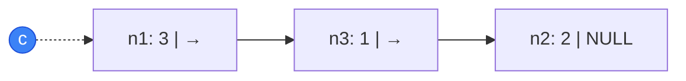

`while (c != NULL)` 루프로 순서대로 출력: n1.v=**3** → n3.v=**1** → n2.v=**2**

Output:
```
312
```

### 예제 3 — 동적 삽입 & 노드 이동 (reconnect)

```c
#include <stdio.h>
#include <stdlib.h>

typedef struct Data {
    int value;
    struct Data *next;
} Data;

// 리스트 맨 앞에 새 노드 삽입 (동적 할당)
Data *insert(Data *head, int value) {
    Data *n = (Data *)malloc(sizeof(Data));
    n->value = value;
    n->next = NULL;
    if (head == NULL) return n;
    n->next = head;
    head = n;
    return head;
}

// 값이 x인 노드를 찾아 리스트의 맨 앞으로 이동
Data *reconnect(Data *head, int x) {
    Data *prev = head, *curr = head->next;
    while (curr && curr->value != x) {
        prev = curr;
        curr = curr->next;
    }
    if (curr == NULL) return head;
    prev->next = curr->next;  // x 노드를 리스트에서 분리
    curr->next = head;        // x 노드가 기존 head를 가리킴
    return curr;              // x 노드가 새 head
}

int main() {
    Data *head = NULL, *curr = NULL, *tmp = NULL;
    int i;
 삽입 → 역순으로 쌓임
    }
    for (i = 1; i <= 5; i++) {
        head = insert(head, i);  // 맨 앞에

    head = reconnect(head, 3);   // 값 3인 노드를 맨 앞으로

    for (curr = head; curr != NULL; curr = curr->next)
        printf("%d", curr->value);

    while (head) {               // 동적 할당 해제
        tmp = head;
        head = head->next;
        free(tmp);
    }
    return 0;
}
```

**insert 루프 후** — 1~5를 순서대로 맨 앞에 삽입하므로 역순으로 쌓임

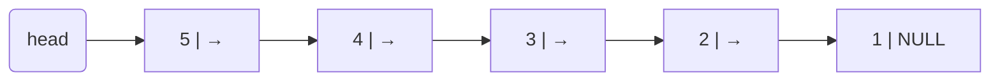

**reconnect(head, 3) 탐색 중** — prev와 curr를 이동해 값이 3인 노드를 탐색

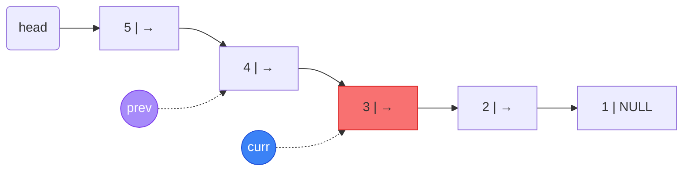

**reconnect 후** — 노드 3을 분리해 맨 앞으로 이동: `prev->next = curr->next`, `curr->next = head`

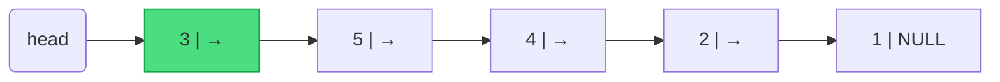

`printf` 루프로 순서대로 출력: 3 → 5 → 4 → 2 → 1

Output:
```
35421
```